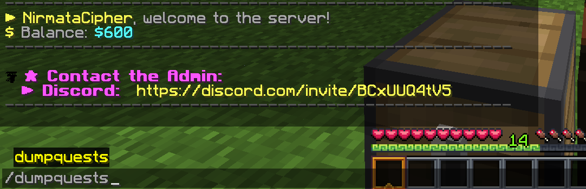
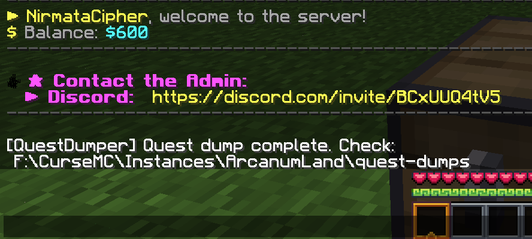
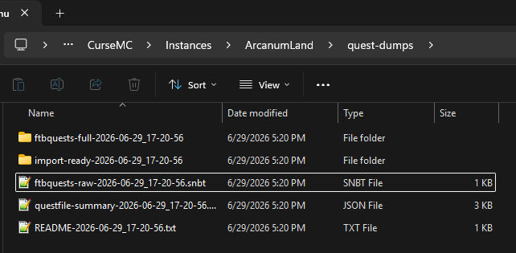
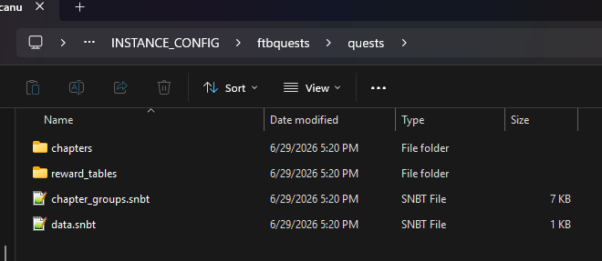
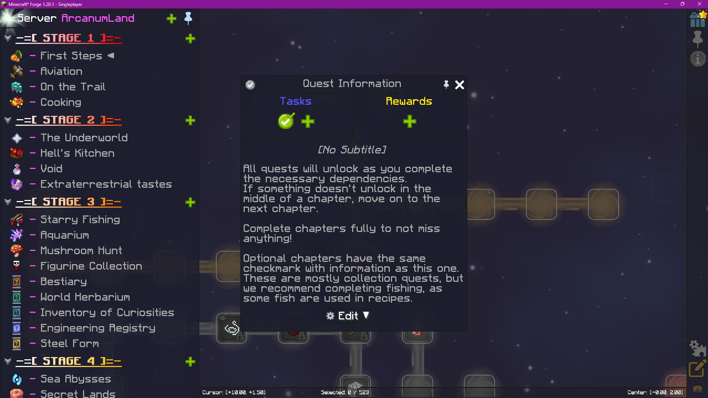

# Arcanum Quest Dumper


> A Forge 1.20.1 client side utility for exporting synchronized FTB Quests data from multiplayer servers into reusable SNBT files.

**Author:** NirmataCipher

---

# Overview

Arcanum Quest Dumper is a lightweight Forge client side mod that exports synchronized FTB Quests data from multiplayer servers into reusable SNBT files.

The exported data can be used for:

* Offline documentation
* Quest analysis
* Backup and archival
* Reverse engineering quest packs
* Converting multiplayer quest packs into usable single player quest packs

The mod is entirely client side. It does **not** modify the server and does **not** require installation on the server.

---

# Current Features

- Client side only
- Forge 1.20.1 support
- Complete FTB Quests export
- Chapter export
- Reward table export
- Chapter group export
- Timestamped exports
- Import ready quest pack generation

---

# Confirmed Working

Version **1.0.0** has been tested successfully using the **ArcanumLand** modpack.

Confirmed functionality:

* Complete quest dump
* Import ready export generation
* Single player import
* Quest progression
* Quest completion
* Reward tables
* Reward claiming

### Import Location

```text
<Minecraft Instance>/config/ftbquests/quests/
```

Use the generated **Import Ready** folder, **not** the raw dump folder.

## Screenshots

### Running the Export using /dumpquest command





### Generated Files go into "import-ready-date" 



### Export Contents



### Imported into Single Player


### Imported into Single Player with edit mode



---

# Requirements

### Minecraft

```text
1.20.1
```

### Forge

```text
47.4.x
```

### Java

```text
17
```

---

# Quick Start

1. Download the latest release from the Releases page.
2. Place the JAR into your Minecraft `mods` folder.
3. Join a multiplayer server running FTB Quests.
4. Wait for quests to finish synchronizing.
<<<<<<< HEAD
5. open quest book flip through chapters for fun then exit
6. Run:
=======
5. Run:
>>>>>>> main

```text
/dumpquests
```

6. Close Minecraft.
7. Copy:

```text
quest-dumps/import-ready-YYYY-MM-DD_HH-MM-SS/INSTANCE_CONFIG/ftbquests
```

to

```text
<Instance>/config/
```

8. Create a brand new single player world.
9. Open the quest book.

---

# Building

Clone the repository:

```bash
git clone https://github.com/TylerDubs/arcanum-quest-dumper.git
```

Enter the project:

```bash
cd arcanum-quest-dumper
```

Build:

```bash
build.bat
```

or

```bash
gradlew build
```

Compiled JAR:

```text
build/libs/
```

---

# Installation

Copy the compiled JAR into:

```text
.minecraft/mods/
```

or

```text
<CurseForge Instance>/mods/
```

Launch Minecraft normally.

---

# In Game Commands and Import Instructions

## Dumping Quests

Join the multiplayer server and wait until the quest book is fully loaded.

Run:

```text
/dumpquests
```

The mod will create export folders inside:

```text
<Instance Folder>/quest-dumps/
```

Look for the newest folder named:

```text
import-ready-YYYY-MM-DD_HH-MM-SS
```

Inside that folder, open:

```text
INSTANCE_CONFIG/
```

You should see:

```text
ftbquests/
```

---

## Importing Into Single Player

Close Minecraft completely.

Copy this folder:

```text
quest-dumps/import-ready-YYYY-MM-DD_HH-MM-SS/INSTANCE_CONFIG/ftbquests
```

Paste it into your Minecraft instance config folder:

```text
<Instance Folder>/config/
```

Final layout must be:

```text
<Instance Folder>/config/ftbquests/quests/
```

Do not place it in:

```text
saves/<world>/serverconfig/
```

Do not place it in:

```text
saves/<world>/ftbquests/
```

Those folders are used for world progress, not the imported quest database.

---

## Testing the Import

After copying the folder:

1. Start Minecraft.
2. Create a brand new single player world.
3. Open the quest book.
4. Confirm chapters appear.
5. Complete a simple quest.
6. Claim a reward.

If chapters appear and rewards work, the import succeeded.
---

# Current Output

```
quest-dumps/
├── ftbquests-full-YYYY-MM-DD_HH-MM-SS/
│   ├── chapters/
│   ├── reward_tables/
│   ├── chapter_groups.snbt
│   └── data.snbt
│
└── import-ready-YYYY-MM-DD_HH-MM-SS/
    └── INSTANCE_CONFIG/
        └── ftbquests/
            └── quests/
```

---

# Changelog

## v1.0.0

Initial public release.

### Added

- Client side quest exporter
- Import ready quest pack generation
- Verified ArcanumLand compatibility
- Complete chapter export
- Reward table export

---

# Development Roadmap

## v1.0.0 ✅

- [x] Client side exporter
- [x] Complete quest dump
- [x] Import ready export
- [x] Verified single player import

---

## v2.1 Command Improvements

- [ ] /dumpquests status
- [ ] /dumpquests path
- [ ] /dumpquests open
- [ ] /dumpquests clean
- [ ] Better export messages

---

## v2.2 Automatic Export

- [ ] Detect quest synchronization
- [ ] Automatically export quests
- [ ] Automatic notifications

---

## v2.3 Validation

- [ ] Validate exported packs
- [ ] Metadata generation
- [ ] Missing file detection

---

## v3.0 Progress Export

- [ ] Player progress
- [ ] Team progress
- [ ] Completed quests
- [ ] Claimed rewards

---

## v4.0 Converter

- [ ] Quest pack repair
- [ ] Standalone converter
- [ ] Automatic installer

---

## v5.0 GUI

- [ ] Export manager
- [ ] Quest browser
- [ ] Search
- [ ] Configuration

---

# Repository

https://github.com/TylerDubs/arcanum-quest-dumper

---

# Support

If you encounter a bug or have a feature request, please open an Issue on GitHub.

Before reporting a bug, include:

- Minecraft version
- Forge version
- FTB Quests version
- Latest log
- Steps to reproduce

---

# License

License to be determined.

---

# Disclaimer

This project is intended for educational, archival, interoperability, and personal backup purposes.

Users are responsible for complying with the licenses and terms governing any quest packs or servers whose data they export.
